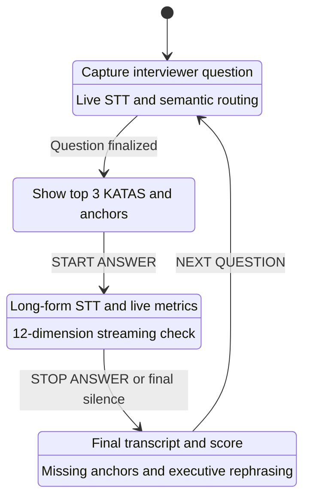
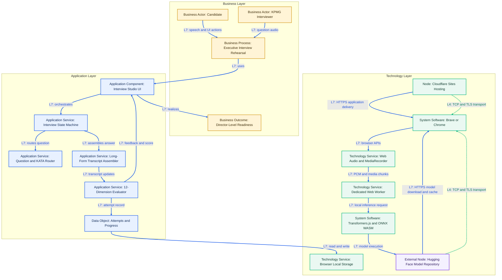
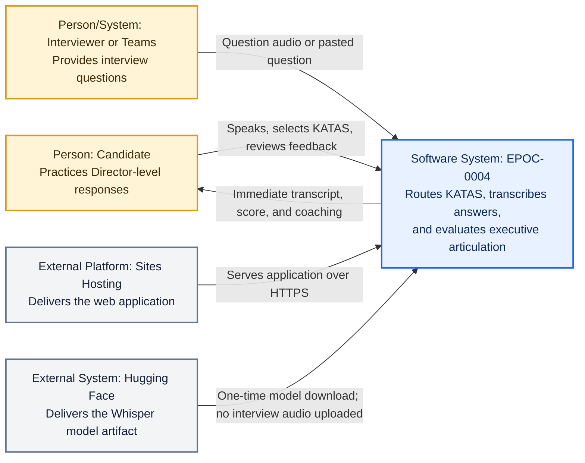
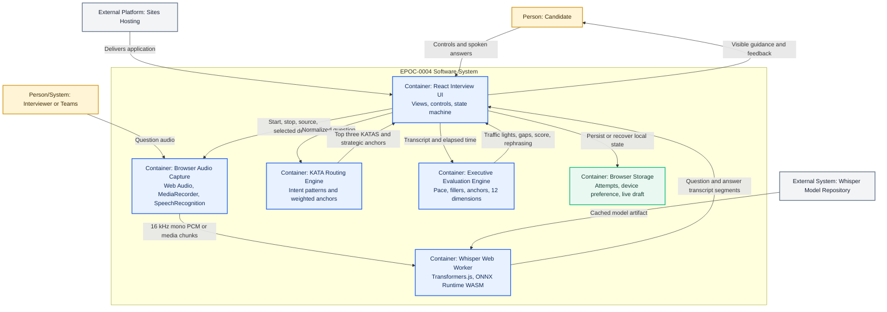
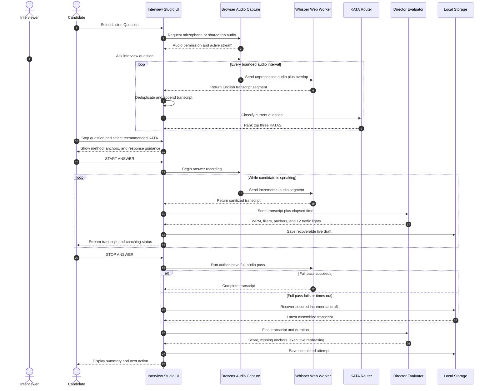

# EPOC-0004 — Interview Preparation with KATAS

Executive interview rehearsal environment for the **KPMG Director of Strategic Projects & IT Core Technologies Enterprise Architecture** role.

EPOC-0004 captures an interviewer question, recommends the most relevant response KATAS, transcribes the candidate's answer locally, and evaluates executive articulation against measurable Director-level criteria.

> Production: [EPOC-0004 Interview Studio](https://epoc-0004-interview-studio.g-gomez734222.chatgpt.site)

## Expansion modules — 25 September 2026

The following additions are versioned as **implementation-ready design contracts**, not as deployed Interview Studio features:

- [Role-Based AI / Architecture KATAs](docs/role-based-ai-katas.md) — RAI-K14–RAI-K40, including verified live LTM questions, clearly labelled publicly reported interview themes, JD-derived exercises, role routing, and short-answer mode. The original K0–K13 catalog retains its KPMG provenance.
- [Architecture Sizing Lab](docs/architecture-sizing-lab.md) — SIZE-K01–SIZE-K14; discovery input classification, CPU/RAM/VRAM, RPM/TPM, HPA, node/GPU capacity, RAG indexing, observability, P95/P99, and TCO.

**Implementation status:** This repository currently contains the README and these two documentation files, but not the application source files described below. The published Interview Studio has not been modified by these documentation commits. UI integration, router updates, persistence, and automated tests must be performed in the actual application codebase and verified before marking the modules deployed.

## 1. Purpose

The application supports four synchronized capabilities:

1. **Question capture and routing** — captures microphone or shared Teams/tab audio, transcribes the question, and ranks the three most relevant KATAS.
2. **Guided preparation** — exposes the method, anchors, model response, business evidence, North Star, and likely follow-up questions.
3. **Answer rehearsal** — records and transcribes answers longer than ten minutes without replacing previously recognized text.
4. **Executive evaluation** — measures time, pace, fillers, content anchors, and twelve KPMG Director dimensions.

## 2. Current scope

| Capability | Implementation |
| --- | --- |
| Interview workflow | Four-state machine: Listening, Readiness, Answering, Summary |
| Question sources | Selected microphone or browser/Teams window shared with audio |
| Speech-to-text | Browser Speech Recognition where available; private Whisper fallback in Brave |
| Whisper runtime | `whisper-tiny.en` through Transformers.js and ONNX Runtime WASM |
| Long-form transcription | 25-second inference windows, 4-second model stride, incremental assembly, and 2-second live overlap |
| KATA routing | Deterministic semantic/intent scoring across K0–K13 |
| Live measurements | Duration, WPM, filler count/rate, captured words, missing anchors |
| Director evaluation | Twelve three-state dimensions: Green, Yellow, Red |
| Persistence | Device-local attempts and recoverable live transcript draft in `localStorage` |
| Deployment | Vinext/React application deployed through Cloudflare-based Sites hosting |

## 3. KATA catalog

| ID | Topic | Primary method |
| --- | --- | --- |
| K0 | Executive introduction and why KPMG | Present role → Evidence → Differentiator → Why KPMG |
| K1 | Enterprise Architecture assessment | Outcomes → Current state → Options → Roadmap → Governance |
| K2 | Cross-functional AI-First transformation | STAR: Mandate → Alignment → Governed execution → Value |
| K3 | Technology investment and product selection | STAR: Baseline → Criteria → POC → Decision → Value |
| K4 | Global application portfolio roadmap | STAR: Maturity → Inventory → Risk → Target roadmap |
| K5 | Lightweight effective governance | Principle → Mechanism → Exception path → Metrics |
| K6 | Agentic AI implementation | Value → Workflow → Architecture → Controls → Pilot → Scale |
| K7 | When not to use Agentic AI | Determinism → Data → Accountability → Risk → Simpler option |
| K8 | Platform-level scalable solution | Capabilities → Guardrails → Operations → Product ownership |
| K9 | First 90 days | Day 30 → Day 60 → Day 90 → Executive scorecard |
| K10 | Powered Enterprise core transformation | What → How → Where → North Star → Sustain |
| K11 | Connected Enterprise architecture | What → How → Where → North Star → Sustain |
| K12 | Core portfolio rationalization / ClariTI | What → How → Where → North Star → Sustain |
| K13 | Trusted Agentic AI governance | What → How → Where → North Star → Sustain |

## 4. Four-state interview workflow



## 5. ArchiMate-style layered architecture

This viewpoint uses ArchiMate-inspired **Business**, **Application**, and **Technology** layers. Line colors distinguish the communication level:

- **L4 green (`#10B981`)** — TCP/TLS transport path.
- **L7 blue (`#2563EB`)** — application interaction, HTTPS, browser API, Web Worker message, transcript, or evaluation flow.



### Layer responsibilities

| ArchiMate layer | Responsibility |
| --- | --- |
| Business | Candidate preparation, interviewer interaction, measurable readiness outcome |
| Application | State orchestration, question routing, transcript assembly, evaluation, feedback |
| Technology | Browser capture, audio processing, local inference, hosting, model cache, local persistence |

## 6. C4 Level 1 — System Context



### Context boundary

- Interview audio and Whisper inference remain in the browser.
- The model repository receives a model artifact request, not the captured interview audio.
- The current evaluator is deterministic and client-side; no external LLM API is required for scoring.
- Teams integration uses browser window/tab audio sharing, not Microsoft Graph meeting transcription.

## 7. C4 Level 2 — Container View



## 8. Interview sequence



## 9. Long-form transcription design

The original cumulative approach repeatedly transcribed an ever-growing audio blob and could replace early transcript content. The current design prevents that failure through bounded incremental processing.

```mermaid
flowchart LR
    Audio[Continuous audio] --> Chunk[25-second Whisper windows]
    Chunk --> Stride[4-second model stride]
    Stride --> Live[Unprocessed PCM plus 2-second live overlap]
    Live --> Clean[Remove non-speech event markers]
    Clean --> Merge[Maximum 24-word overlap deduplication]
    Merge --> Draft[Persistent local draft]
    Draft --> Final[Authoritative final pass]
    Final --> Evaluate[Director evaluation]
```



### Reliability controls

- **Bounded inference:** Whisper processes 25-second windows rather than a single long context.
- **Overlap protection:** model stride and live overlap reduce boundary word loss.
- **Transcript monotonicity:** new text is appended after overlap deduplication; earlier content is not replaced.
- **Progress preservation:** the latest assembled answer is written to a device-local draft.
- **Final authority:** `STOP ANSWER` runs a complete final transcription.
- **Graceful degradation:** if the final pass fails, the secured incremental transcript remains evaluable.
- **Self-healing worker:** a failed Whisper session is terminated and restarted once with a clean worker.
- **Bounded timeout:** long-form inference is allowed up to twenty minutes before recovery logic is used.
- **False-positive rejection:** markers such as `[speaking in foreign language]`, silence, inaudible, or no speech never satisfy the English preflight.

## 10. Director evaluation model

The answer is evaluated against twelve dimensions:

1. KPMG framework alignment.
2. Business value translation.
3. Governance and operating model.
4. Executive articulation.
5. Investment and portfolio discipline.
6. Cross-functional orchestration.
7. Risk, security, and resilience.
8. Data and integration architecture.
9. Executable roadmap.
10. People, change, and adoption.
11. Scalable platform thinking.
12. Evidence and sustained outcomes.

Each dimension uses a deterministic three-state interpretation:

| State | Meaning |
| --- | --- |
| Green | Explicit evidence, actionable mechanism, business context, or metric |
| Yellow | Concept mentioned without sufficient operating or value evidence |
| Red | Critical dimension not addressed |

### Speech thresholds

| Metric | Green | Yellow | Red |
| --- | --- | --- | --- |
| Pace | 125–160 WPM | 100–124 or 161–180 WPM | Below 100 or above 180 WPM |
| Fillers | 0–1 per minute | 2–3 per minute | 4 or more per minute |
| Anchors | Business context and evidence | Isolated or technical mention | Missing |
| Dimensions | Strategic outcome proven | Conceptual coverage | Not addressed |

## 11. Privacy, security, and trust boundaries

- Microphone permission is controlled by the browser and operating system.
- Captured audio is held in browser memory during the session.
- Whisper inference runs locally inside a dedicated Web Worker using CPU/WASM.
- Interview audio is not sent to the Whisper model repository.
- Attempts and recoverable drafts are stored only in the browser's local storage.
- No credentials or API keys are embedded in the client application.
- Clearing browser site data removes local attempts, device preferences, and drafts.
- Shared Teams/tab audio requires an explicit browser selection and **Share audio** approval.

## 12. Failure handling

| Failure | Detection | Recovery |
| --- | --- | --- |
| Microphone unavailable | Permission or missing audio track | Select the correct input and repeat preflight |
| Audio present, no English | Gate 1 passes; Gate 2 fails | Read only the displayed English sentence and retry |
| Brave speech-network block | Browser recognition network error | Automatically use private local Whisper |
| WebGPU unavailable | GPU adapter initialization failure | Force the universally supported WASM backend |
| Whisper marker output | Foreign-language/silence/inaudible marker | Sanitize marker and reject English verification |
| Worker/model transient error | Worker error or timeout | Terminate worker and retry in a clean session |
| Long answer interruption | Missing final pass | Recover the latest incremental local draft |
| Teams audio absent | Shared stream has no audio track | Re-share the correct window/tab with Share audio enabled |

## 13. Technology stack

- React 19
- Next.js 16 application model
- Vinext and Vite
- TypeScript
- Cloudflare Worker-compatible Sites runtime
- Browser MediaDevices, MediaRecorder, Web Audio, and Speech Recognition APIs
- Hugging Face Transformers.js
- ONNX Runtime WASM
- Whisper Tiny English
- Node.js test runner

## 14. Repository structure

```text
app/
├── InterviewStudio.tsx   # KATAS, workflow, capture, routing, scoring, UI
├── whisper.worker.ts     # Local Whisper model lifecycle and inference
├── globals.css           # Executive Studio visual system
├── layout.tsx            # Site metadata and application layout
└── page.tsx              # Application entry point
tests/
├── interview-state-machine.test.mjs
├── kpmg-strategy-contract.test.mjs
└── whisper-contract.test.mjs
scripts/
├── build-verified.sh
└── validate-artifact.sh
```

## 15. Local development

### Prerequisites

- Node.js 22.13 or newer
- A current desktop version of Brave or Chrome
- An English-capable microphone or headset

### Commands

```bash
npm ci
npm run dev
```

Run the architecture and behavioral contracts:

```bash
node --test \
  tests/whisper-contract.test.mjs \
  tests/kpmg-strategy-contract.test.mjs \
  tests/interview-state-machine.test.mjs
```

Create the production artifact:

```bash
npm run build
```

## 16. Operating procedure

1. Open **Microphone Lab**.
2. Select the actual headset microphone.
3. Run the two-gate preflight and read only the displayed test sentence.
4. Confirm that both Audio Capture and English Transcription pass.
5. Open **Question Router** and select microphone or Teams/tab audio.
6. Capture the interviewer question and review the three recommended KATAS.
7. Select the best KATA and move to **Practice Studio**.
8. Start the answer, monitor pace/fillers/anchors, and stop only after completing it.
9. Review the final score, missing anchors, and executive rephrasing.
10. Repeat until the answer consistently reaches the target score without sounding memorized.

## 17. Known limitations

- English is the only supported interview language in the current Whisper model.
- CPU/WASM finalization can take several minutes for recordings longer than ten minutes.
- Accuracy depends on microphone quality, Bluetooth profile, background noise, accent, and speaking pace.
- Browsers may throttle long processing when the tab is moved to the background.
- Teams audio capture depends on browser/OS screen-sharing support and is not a direct Teams meeting-transcript API.
- The current KATA router and evaluator are deterministic; the embedded strategic prompt is a design contract for a future optional LLM evaluator.

## 18. Architecture decisions

| Decision | Rationale |
| --- | --- |
| Local Whisper rather than mandatory cloud STT | Avoids an additional API dependency and keeps interview audio local |
| WASM rather than WebGPU-first | Provides predictable compatibility in Brave and on systems without a usable GPU adapter |
| Deterministic routing and scoring | Produces repeatable coaching without external model cost or network dependency |
| Incremental plus final transcription | Balances live visibility, long-session resilience, and final accuracy |
| Device-local persistence | Recovers practice progress without introducing a backend data store |
| Four-state workflow | Separates question capture, preparation, answer delivery, and evaluation responsibilities |

## 19. Validation status

The current architecture is protected by automated contracts for:

- Four-state interview behavior.
- Fourteen KATAS and KPMG methodology coverage.
- Twelve Director evaluation dimensions.
- Brave-safe English Whisper configuration.
- Long-form chunking, overlap, deduplication, draft recovery, and final authority.
- Rejection of non-speech or foreign-language markers during preflight.

## 20. Ownership

**Product owner and candidate:** Guillermo Gómez<br>
**Current professional positioning:** Managing Advisor, Artifex Consulting; CAIO, AITESYS<br>
**Target interview:** KPMG — Director of Strategic Projects & IT Core Technologies Enterprise Architecture
